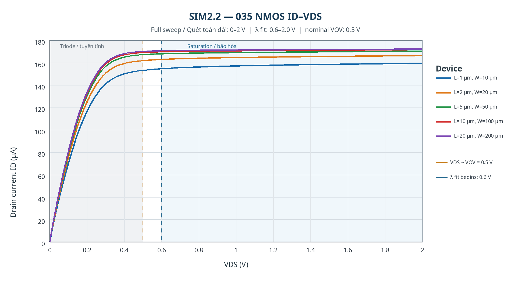
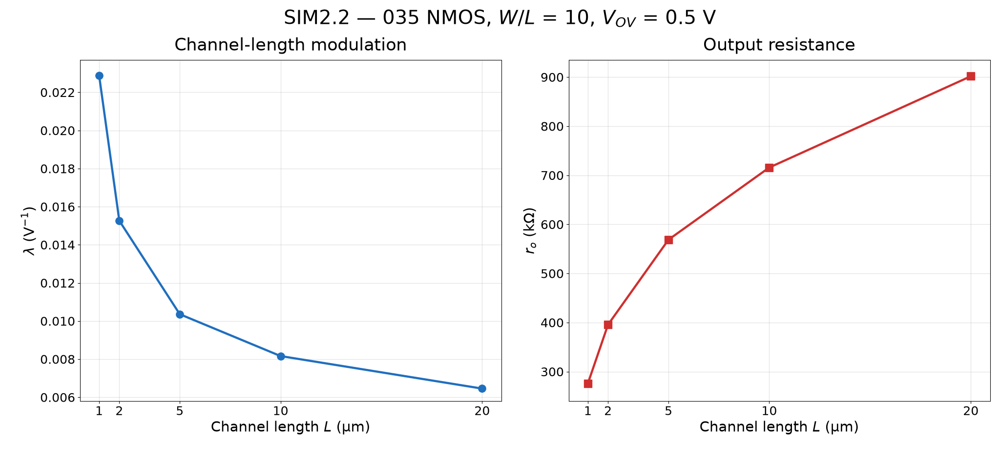

# SIM2.2 — Điều chế chiều dài kênh của NMOS 035

## (a) Khảo sát λ và r_o

Phần (a) trình bày cách chọn kích thước và điểm phân cực, cách quét `VDS`, sau đó ước lượng `λ` và tính `r_o` theo các công thức trong đề.

Mô phỏng sử dụng mô hình `NM` Level 8 BSIM3 và symbol `nmos_035` trong thư viện LTspice 035 được cung cấp. Cực source và bulk nối đất. Tỉ số kích thước được giữ cố định ở `W/L = 10` cho cả năm transistor.

Đề yêu cầu giữ điện áp vượt ngưỡng không đổi nhưng không chỉ định giá trị số của `VOV` hay hai đầu sweep `VDS`. Trong mô phỏng này, chọn `VOV danh định = 0,500 V` làm điểm phân cực tham chiếu. Với model được cung cấp, `Vth` tại `VDS = 1 V` nằm khoảng 0,500–0,536 V cho năm chiều dài kênh, nên `VGS` tương ứng xấp xỉ 1,0 V. `VGS` được hiệu chỉnh riêng cho từng chiều dài từ `Vth` tại điểm làm việc của LTspice ở `VDS = 1,0 V`, theo công thức `VGS = Vth + VOV`; nhờ vậy các chiều dài kênh được so sánh ở cùng overdrive danh định.

| L (μm) | W (μm) | Vth tại VDS = 1 V (V) | VGS (V) | VOV danh định (V) |
|---:|---:|---:|---:|---:|
| 1 | 10 | 0,536 | 1,036 | 0,500 |
| 2 | 20 | 0,518 | 1,018 | 0,500 |
| 5 | 50 | 0,506 | 1,006 | 0,500 |
| 10 | 100 | 0,502 | 1,002 | 0,500 |
| 20 | 200 | 0,500 | 1,000 | 0,500 |

Đặc tuyến đầy đủ được quét từ `VDS = 0 V` đến `2,0 V` với bước 10 mV để quan sát cả vùng tuyến tính (triode) ở điện áp thấp và vùng bão hòa. Giới hạn trên 2,0 V là lựa chọn của mô phỏng để có khoảng điện áp đủ rộng quan sát độ dốc dòng điện đầu ra.

Theo tiêu chuẩn gần đúng của mô hình kênh dài, ranh giới bão hòa là `VDS ≈ VGS − Vth = VOV`, tương đương khoảng 0,5 V với điểm phân cực đã chọn. Khi tính `λ`, bắt đầu tại 0,6 V, cao hơn ranh giới danh định 0,1 V, và chỉ dùng đoạn bão hòa 0,6–2,0 V. Mốc 0,6 V tạo khoảng đệm với điểm gối; các điểm thấp hơn vẫn được giữ trên đồ thị đặc tuyến đầy đủ nhưng không đưa vào phép khớp vùng bão hòa. Các giới hạn số này do mô phỏng chọn, đề không quy định cụ thể.

Điện áp cổng được giữ cố định trong mỗi lượt quét `VDS`. Vì model BSIM3 có thể làm `Vth` hiệu dụng thay đổi nhẹ theo `VDS`, `VOV = 0,500 V` được khớp tại điểm tham chiếu `VDS = 1,0 V`; giá trị này là overdrive danh định, không hoàn toàn bất biến ở mọi điểm quét.

### (a.1) Phương pháp tính

Trong vùng bão hòa, sử dụng biểu thức gần đúng theo yêu cầu bài tập:

\[
I_D \approx I_{D0}(1+\lambda V_{DS}).
\]

Ước lượng độ dốc trung bình chỉ trên đoạn bão hòa đã chọn, dùng dòng điện mô phỏng tại `VDS = 0,6 V` và `2,0 V`:

\[
g_{ds}\approx\frac{I_D(2{,}0\,\mathrm V)-I_D(0{,}6\,\mathrm V)}{2{,}0-0{,}6},\qquad
I_{D0}\approx I_D(0{,}6\,\mathrm V)-0{,}6g_{ds},\qquad
\lambda\approx\frac{g_{ds}}{I_{D0}}.
\]

Đề không chỉ định phải lấy `ID` tại giá trị `VDS` nào trong vùng bão hòa để tính `ro`. Trong báo cáo này, chọn `VDS = 1,3 V`, là trung điểm của khoảng 0,6–2,0 V dùng để khớp độ dốc vùng bão hòa. Cách chọn này tránh lấy ngay tại hai đầu khoảng khớp và đại diện cho một điểm làm việc giữa dải để so sánh năm transistor. Nếu chọn một `VDS` khác trong vùng bão hòa thì `ro` sẽ thay đổi nhẹ, vì `ro = 1/(λID)` phụ thuộc vào dòng phân cực.

Sau đó, tính điện trở đầu ra tại điểm đã chọn `VDS = 1,3 V` theo công thức đề bài:

\[
r_o\approx\frac{1}{\lambda I_D(1{,}3\,\mathrm V)}.
\]

Dữ liệu từ 0 V được dùng để vẽ toàn bộ đặc tuyến; các điểm dưới 0,6 V không dùng để tính các thông số trong vùng bão hòa.

### (a.2) Kết quả tính toán

| L (μm) | W (μm) | ID tại 1,3 V (μA) | Độ dốc gds (μS) | λ (V⁻¹) | ro (kΩ) |
|---:|---:|---:|---:|---:|---:|
| 1 | 10 | 158,037 | 3,489 | 0,022876 | 276,611 |
| 2 | 20 | 165,261 | 2,464 | 0,015263 | 396,453 |
| 5 | 50 | 169,485 | 1,729 | 0,010358 | 569,653 |
| 10 | 100 | 170,948 | 1,379 | 0,008162 | 716,706 |
| 20 | 200 | 171,633 | 1,097 | 0,006455 | 902,644 |

## (b) Đồ thị, so sánh và nhận xét

Phần (b) sử dụng cùng dữ liệu của phần (a) để vẽ đặc tuyến `ID–VDS`, biểu diễn `λ` và `r_o` theo `L`, rồi nhận xét xu hướng khi chiều dài kênh tăng.

### (b.1) Đặc tuyến dòng máng đầy đủ, từ 0 V qua vùng bão hòa

Vùng tô xám là vùng triode ở điện áp thấp. Vùng tô xanh đánh dấu khoảng 0,6–2,0 V dùng để ước lượng `λ`.

### (b.2) Hệ số điều chế chiều dài kênh và điện trở đầu ra theo chiều dài kênh

### (b.3) So sánh và nhận xét

Đồ thị đầy đủ `ID`–`VDS` cho thấy dòng tăng gần tuyến tính ở `VDS` thấp, sau đó các đường đặc tuyến phẳng hơn khi transistor vào vùng bão hòa. Chỉ đoạn bão hòa được dùng để ước lượng điều chế chiều dài kênh, phù hợp với công thức gần đúng của bài.

Khi `L` tăng từ 1 μm lên 20 μm, `λ` giảm từ 0,022876 V⁻¹ xuống 0,006455 V⁻¹, trong khi `ro` tăng từ 276,6 kΩ lên 902,6 kΩ. Đường đặc tuyến đầu ra phẳng hơn khi kênh dài hơn, cho thấy điều chế chiều dài kênh yếu đi. Dòng điện tại 1,3 V tăng nhẹ từ 158,0 μA lên 171,6 μA dù `W/L` và overdrive danh định được giữ cố định. Đây là đặc tính của model BSIM3 được cung cấp trên các kích thước đang xét; mô hình bình phương lý tưởng cho kênh dài sẽ dự đoán mức biến thiên nhỏ hơn.

## Các tệp sử dụng

- `../Simulation/SIM2_2_NMOS.asc` — schematic LTspice, quét toàn dải `VDS` từ 0 đến 2,0 V và đo `λ`, `ro` trên đoạn bão hòa.
- `../Simulation/SIM2_2_NMOS_VTH.cir` — netlist hiệu chỉnh điện áp ngưỡng tại `VDS = 1 V`.
- `../Simulation/SIM2_2_NMOS_ID_VDS.csv` — dữ liệu đặc tuyến đầu ra đầy đủ từ 0 đến 2 V.
- `../Simulation/SIM2_2_NMOS_results.csv` — thông số tính từ đoạn bão hòa 0,6–2,0 V.
