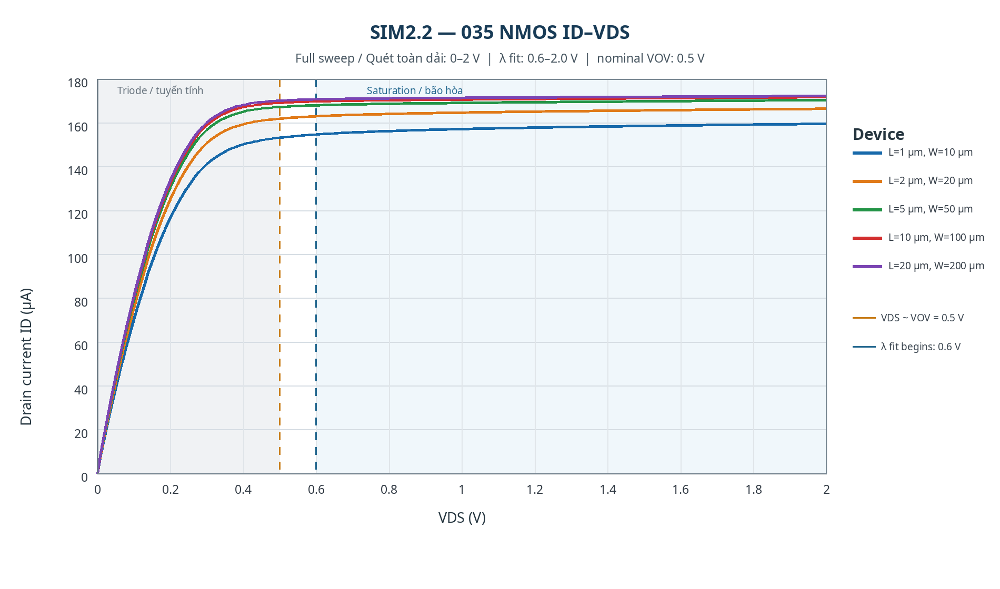
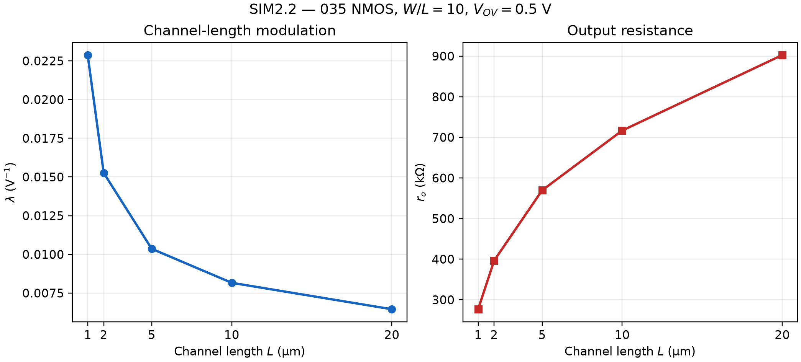

# SIM2.2 — 035 NMOS Channel-Length Modulation

## Setup and selected bias

This simulation uses the `NM` Level 8 BSIM3 model and `nmos_035` symbol from the supplied 035 LTspice library. The source and bulk are grounded. The aspect ratio is held at `W/L = 10` for all five devices.

The assignment requires a constant overdrive but does not prescribe its numerical value or the drain-voltage sweep endpoints. We choose a nominal `VOV = 0.500 V` as a clear, practical bias point. For the supplied model, the threshold at the 1 V reference point is about 0.500–0.536 V across the five lengths, so this target gives `VGS` values near 1.0 V. `VGS` is calibrated separately for each length from the LTspice operating-point `Vth` at `VDS = 1.0 V`, using `VGS = Vth + VOV`; this keeps the nominal overdrive comparable as L changes.

| L (μm) | W (μm) | Vth at VDS = 1 V (V) | VGS (V) | Nominal VOV (V) |
|---:|---:|---:|---:|---:|
| 1 | 10 | 0.536 | 1.036 | 0.500 |
| 2 | 20 | 0.518 | 1.018 | 0.500 |
| 5 | 50 | 0.506 | 1.006 | 0.500 |
| 10 | 100 | 0.502 | 1.002 | 0.500 |
| 20 | 200 | 0.500 | 1.000 | 0.500 |

The full characteristic is swept from `VDS = 0 V` to `2.0 V` in 10 mV steps. This displays the low-`VDS` triode region as well as the saturation region. The upper endpoint of 2.0 V is a selected sweep limit that gives a broad drain-voltage range for observing the output slope.

With the simple long-channel criterion, the saturation boundary is `VDS ≈ VGS − Vth = VOV`, nominally about 0.5 V here. We begin the `λ` calculation at 0.6 V, 0.1 V above that nominal boundary, and use the saturation interval from 0.6 V to 2.0 V. The choice of 0.6 V provides margin from the knee; points below it remain in the full-characteristic plot but are excluded from the saturation fit. These numeric limits are chosen for this simulation, not specified by the assignment.

The gate voltages are fixed during each drain sweep. Because the BSIM3 model can shift its effective `Vth` slightly with `VDS`, the 0.500 V overdrive is matched at the 1.0 V reference point and is nominal over the sweep rather than mathematically exact at every point.

## Method

In saturation, use the assignment's approximation:

\[
I_D \approx I_{D0}(1+\lambda V_{DS}).
\]

Estimate the average slope over the selected saturation interval, using only the simulated values at 0.6 V and 2.0 V:

\[
g_{ds}\approx\frac{I_D(2.0\,\mathrm V)-I_D(0.6\,\mathrm V)}{2.0-0.6},\qquad
I_{D0}\approx I_D(0.6\,\mathrm V)-0.6g_{ds},\qquad
\lambda\approx\frac{g_{ds}}{I_{D0}}.
\]

Then calculate output resistance at `VDS = 1.3 V` using the requested formula:

\[
r_o\approx\frac{1}{\lambda I_D(1.3\,\mathrm V)}.
\]

The sweep starts at 0 V for the plot, but samples below 0.6 V are not used in these saturation-region calculations.

## Results

| L (μm) | W (μm) | ID at 1.3 V (μA) | Slope gds (μS) | λ (V⁻¹) | ro (kΩ) |
|---:|---:|---:|---:|---:|---:|
| 1 | 10 | 158.037 | 3.489 | 0.022876 | 276.611 |
| 2 | 20 | 165.261 | 2.464 | 0.015263 | 396.453 |
| 5 | 50 | 169.485 | 1.729 | 0.010358 | 569.653 |
| 10 | 100 | 170.948 | 1.379 | 0.008162 | 716.706 |
| 20 | 200 | 171.633 | 1.097 | 0.006455 | 902.644 |

## Plots

### Full drain-current characteristic, from 0 V through saturation

The shaded low-voltage region shows the triode portion. The blue shading marks the 0.6–2.0 V interval used to estimate `λ`.

### Channel-length modulation and output resistance versus channel length

## Discussion

The full `ID`–`VDS` plot shows the nearly linear rise at low `VDS`, followed by the flatter saturation-region curves. Only the latter interval is used to estimate channel-length modulation, as required by the saturation approximation.

As `L` increases from 1 μm to 20 μm, `λ` decreases from 0.022876 V⁻¹ to 0.006455 V⁻¹, while `ro` increases from 276.6 kΩ to 902.6 kΩ. The output curves become flatter for longer devices, showing weaker channel-length modulation. The current at 1.3 V rises modestly from 158.0 μA to 171.6 μA even though `W/L` and nominal overdrive are held constant. This is the behavior of the supplied BSIM3 model across these geometries; the ideal long-channel square-law model would predict less variation.

## Files

- `SIM2_2_NMOS.asc` — LTspice schematic; sweeps the full `VDS` range from 0 to 2.0 V and measures `λ` and `ro` over the saturation interval.
- `SIM2_2_NMOS_VTH.cir` — operating-point threshold calibration at `VDS = 1 V`.
- `SIM2_2_NMOS_ID_VDS.csv` — full 0–2 V output-characteristic data.
- `SIM2_2_NMOS_results.csv` — metrics calculated from the 0.6–2.0 V saturation interval.
